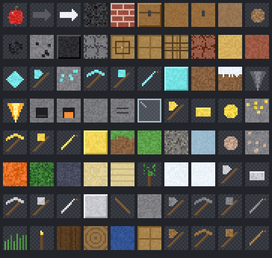

# Yesp

Home of **BlockCraft Modern** — an original Minecraft-style sandbox voxel
game built on the open-source [Luanti](https://www.luanti.org/) engine
(formerly Minetest).

Luanti is the engine; **the game is our own layer** — every block, tool,
crafting recipe, world-generation rule and texture in
[`blockcraft_modern/`](blockcraft_modern/) is original to this project.

👉 **[Open the game →](blockcraft_modern/README.md)**

## What's here

| Path | Description |
|------|-------------|
| [`blockcraft_modern/`](blockcraft_modern/) | The playable Luanti game: 42 blocks, 20 tools, 49 recipes, 5 biomes, ores, furnace/crafting/chest. |
| `blockcraft_modern/mods/bc_core/gen_textures.py` | Procedural texture generator (Pillow) — all art is reproducible. |
| `docs/` | Preview artwork. |

## Quick start

1. Install the Luanti engine (5.16.x+) from <https://www.luanti.org/>.
2. Copy `blockcraft_modern/` into your Luanti `games/` folder.
3. Launch Luanti → create a world → pick **BlockCraft Modern**.

See [`blockcraft_modern/README.md`](blockcraft_modern/README.md) for full
gameplay and build instructions.

## License

Game code is MIT and artwork is CC BY-SA 4.0 (all original) — see
[`blockcraft_modern/LICENSE.txt`](blockcraft_modern/LICENSE.txt). The Luanti
engine is a separate LGPL 2.1+ work and is not bundled here.
